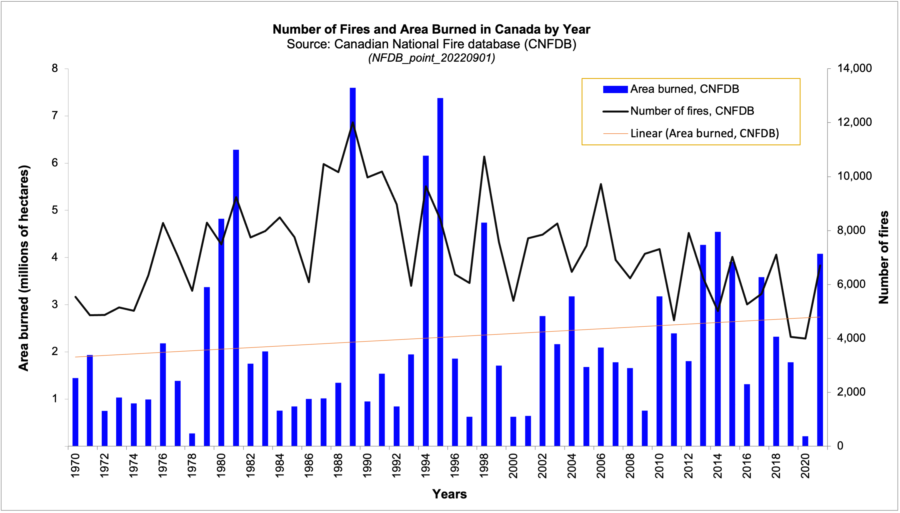

# ENDG 310 - Lab #2

This README.md file should be populated prior to final submission and should include your name (as the author), a description of the lab, some discussion of the results, and should **show** your final infographic.  For example, here is image from the NRCan data:

